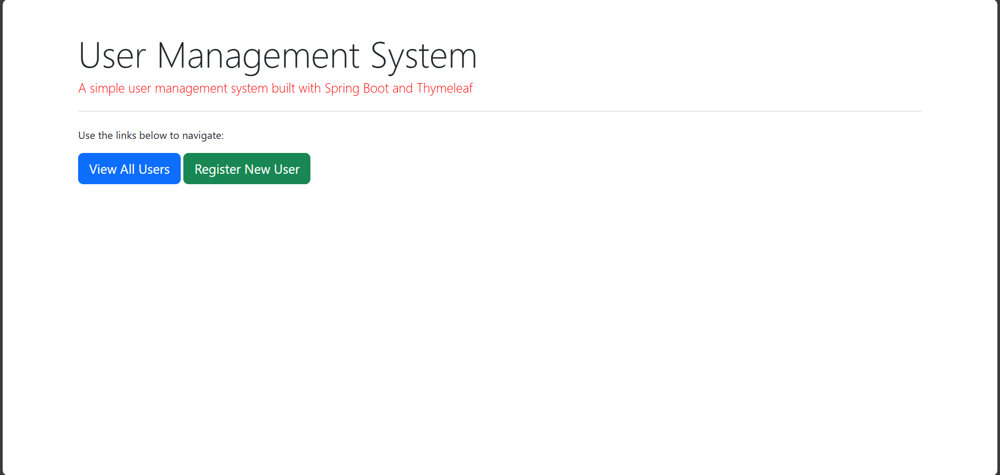
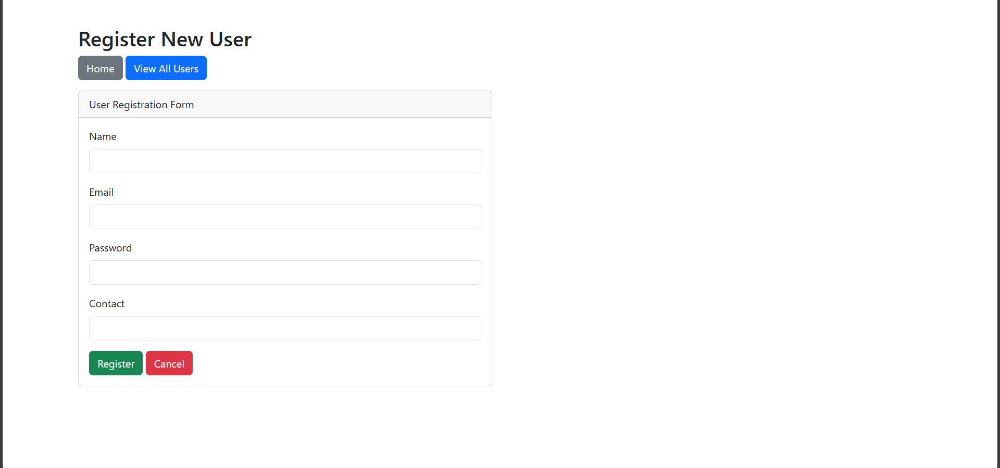
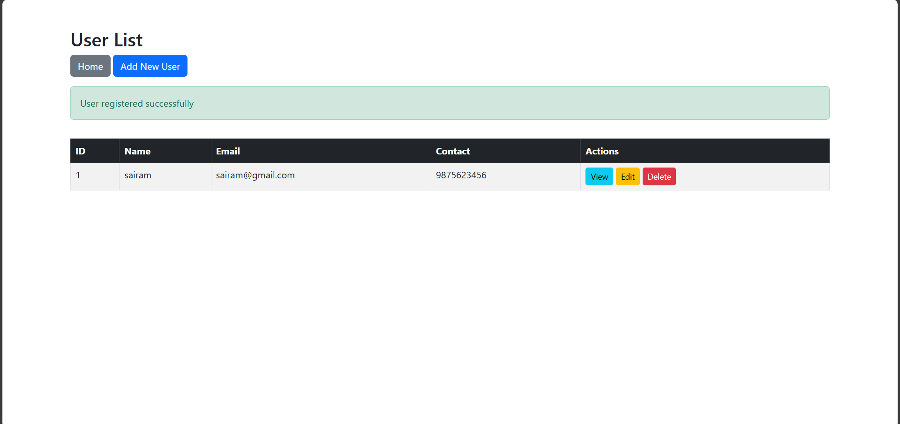
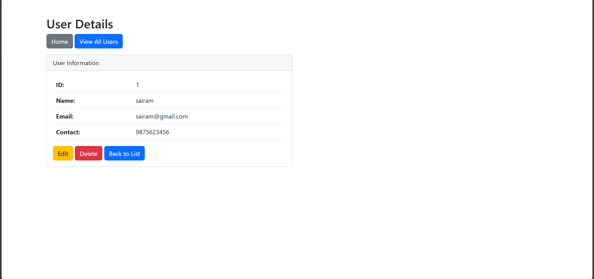
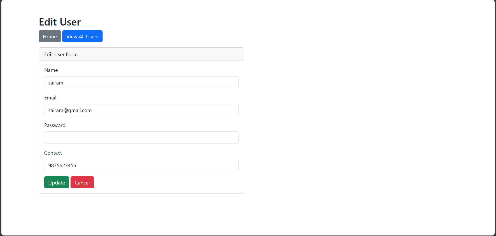
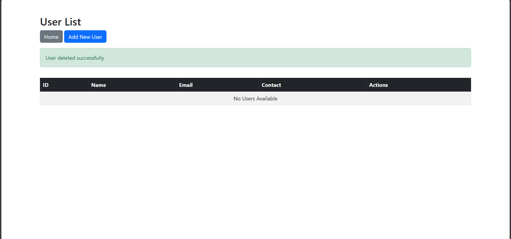

# User Management Application — Java (Spring Boot)

This module represents a real-world enterprise **User Management REST Service** providing:

- Create User  
- View / Search Users  
- Edit User Details  
- Delete User  

### Why This Matters?
- Demonstrates **backend engineering skills** using Java/Spring Boot.
- Shows ability to build **modular microservice-ready applications**.
- Provides a **data foundation for future authentication, RBAC, or login systems**.

### Technologies Used

| Component | Tech |
|-----------|------|
| Language | Java |
| Framework | Spring Boot |
| Build Tool | Maven |
| Testing | JUnit (if used) |
| Packaging | Jar |

### Output Result
Your Java code **runs as a REST Service**, exposing endpoints that will later be:
> **Containerized using Docker → Deployed in Kubernetes → Monitored via Prometheus/Grafana**

## Application Home Page

## User Registration

## User List View

## User Details

## Edit User

## User Deletion

