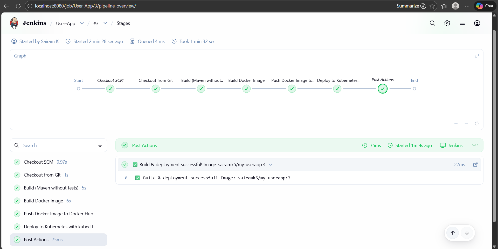
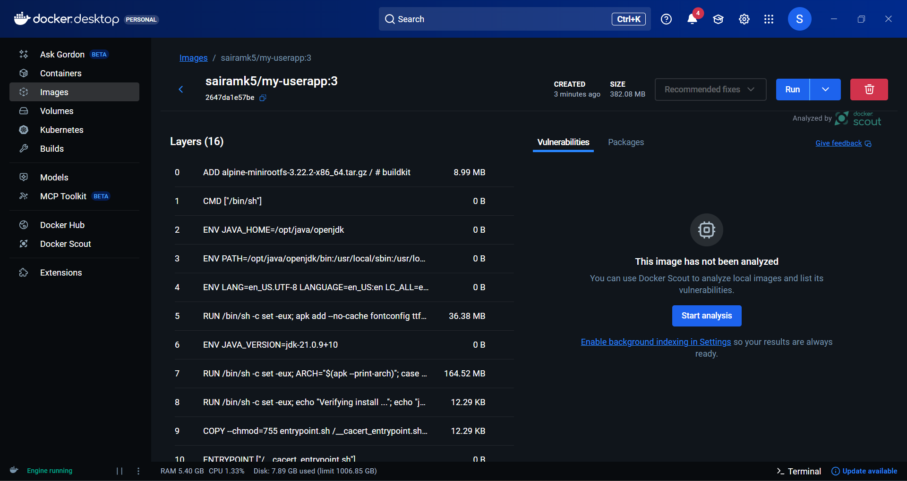

# CI/CD Pipeline — Jenkins

This project features a **fully automated deployment pipeline**, triggered when new code is pushed/pulled from GitHub.

### Pipeline Stages Implemented

| Stage | Purpose |
|-------|---------|
| Code Checkout | Pull latest code from GitHub |
| Build & Test | Validates code using Maven |
| Docker Build | Creates container image of the Java app |
| Push Image   | Push to registry for reuse |
| Deploy to Kubernetes | Application rolls out automatically |

### What This Proves?

- Understanding **complete production CI/CD workflows**.
- No manual deployment — **real automation**.
- DevOps capability beyond “just running Docker”.

> This showcases **real enterprise DevOps skill**.

## Jenkins Pipeline – Successful Execution

This screenshot proves end-to-end CI/CD automation.

## Docker Image Built via Jenkins

## Docker Image Pushed to DockerHub

