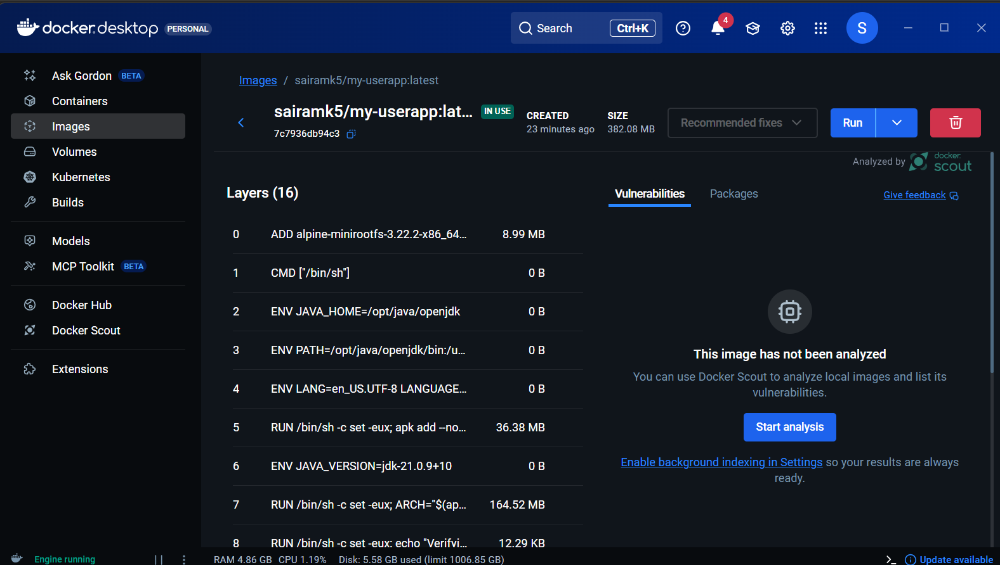
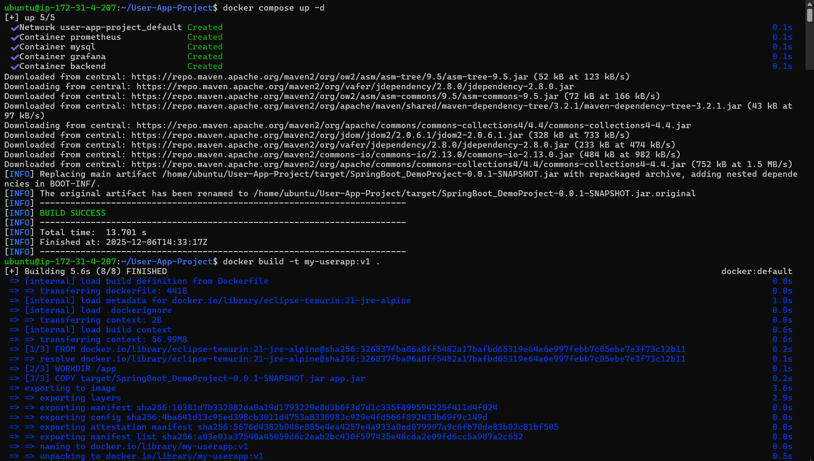
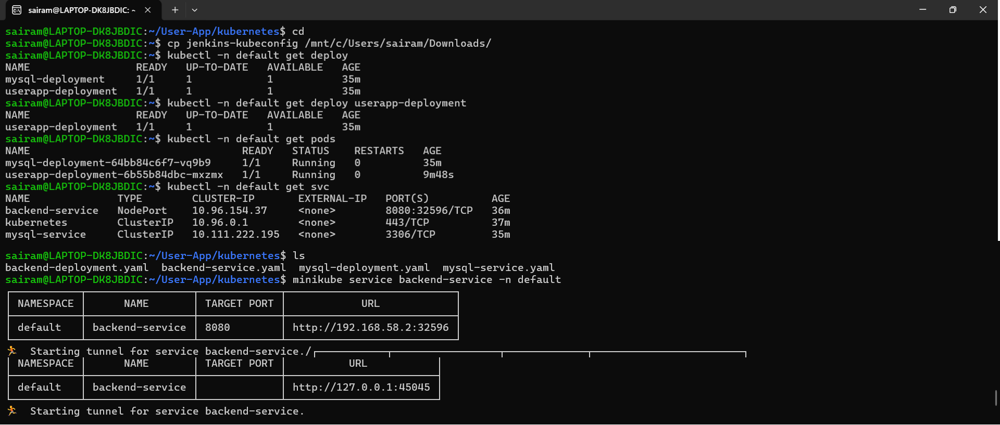
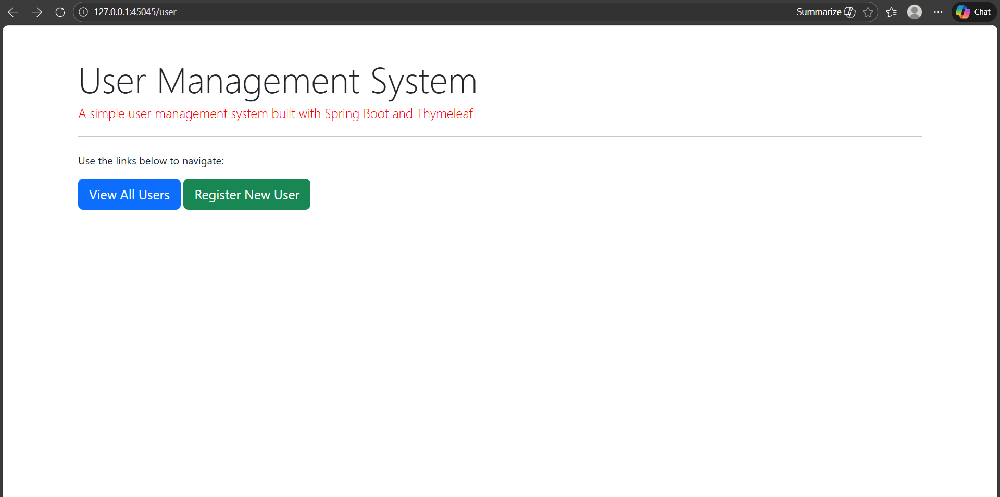

# Docker + Kubernetes Deployment

The Java application is **containerized using Docker** and **orchestrated using Kubernetes (Minikube)**.

### Docker Implementation

- Created `Dockerfile`  
- Application packaged as an image  
- Image deployed locally / registry optional  

### Kubernetes Deployment

| Component | Description |
|-----------|-------------|
| Deployment | Creates multiple Pods |
| Service | Exposes the app externally |
| ReplicaSet | Ensures high availability |
| Pods | Runs app instances |

### Why This Matters?

- Shows **cloud-native, scalable deployment**.
- Demonstrates understanding of **cluster networking + high availability**.

## Docker Image Build

## Docker Compose Deployment (EC2 / Local)

## Application Access via Docker Compose

## Kubernetes Deployment

## Application Access via Kubernetes (NodePort)

