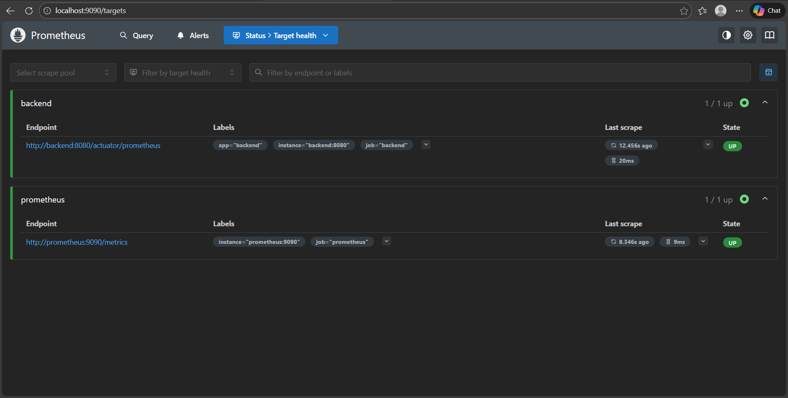
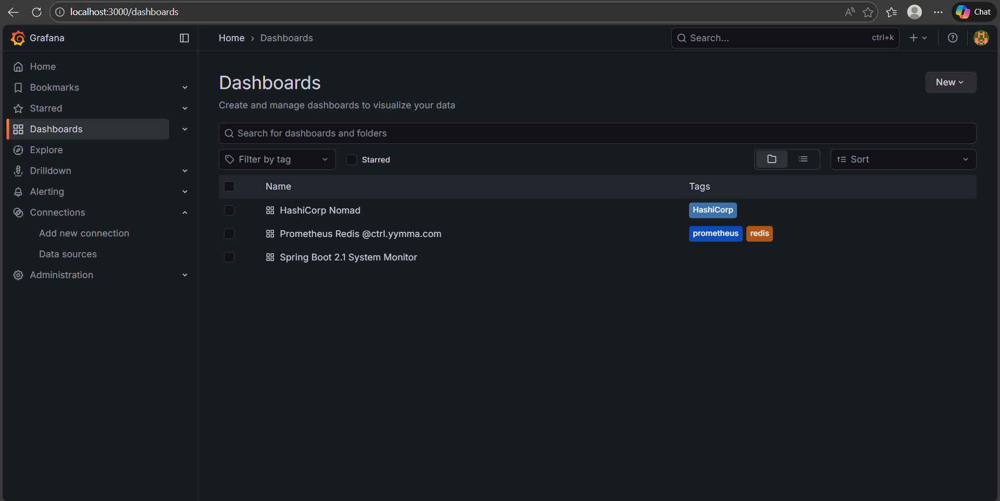

# Monitoring with Prometheus + Grafana

Your app exposes live runtime metrics which are **scraped by Prometheus** and visualized in **Grafana Dashboards**.

### What Metrics Are Monitored?

| Metric | Purpose |
|--------|---------|
| JVM Memory & CPU | Tracks performance usage |
| HTTP Request Latency | Monitors response time |
| Pod Resource Usage | Identifies scaling needs |
| Application Health | Failure & uptime tracking |

### Why This Matters?

> Recruiters see you understand **SRE + DevOps observability**, not just deployment.

- Indicates capacity for **production stability**
- Proves readiness for **scaling + performance tuning**
- Shows knowledge of **metrics publishing & visualization**

## Prometheus Status

## Grafana Dashboards

